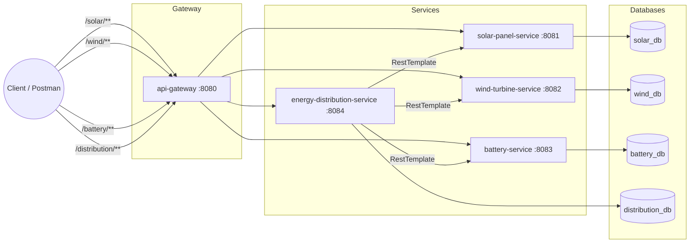

# Renewable Energy Monitoring System

A microservices-based system for monitoring solar and wind generation, managing
battery storage, distributing renewable energy, and detecting equipment
faults across a renewable energy company's fleet of solar farms, wind
turbines, and battery storage units.

---

## 1. Project Overview

The system is split into five independently deployable Spring Boot
microservices, fronted by a single API Gateway:

| Service | Responsibility | Port | Database |
|---|---|---|---|
| `solar-panel-service` | CRUD for solar panels, hourly generation recording, zero-generation fault lookup | 8081 | `solar_db` |
| `wind-turbine-service` | CRUD for wind turbines, hourly power output recording, zero-output fault lookup | 8082 | `wind_db` |
| `battery-service` | Battery CRUD, charge/discharge, capacity queries, low-battery alerts | 8083 | `battery_db` |
| `energy-distribution-service` | Aggregates solar + wind generation (via RestTemplate), coordinates battery charge/discharge, distributes power, runs fault detection, generates reports | 8084 | `distribution_db` |
| `api-gateway` | Single entry point, routes `/solar/**`, `/wind/**`, `/battery/**`, `/distribution/**` to the services above | 8080 | — |

### Core business flow
1. Solar panels and wind turbines report hourly generation/output.
2. `energy-distribution-service` aggregates total renewable generation via
   REST calls to `solar-panel-service` and `wind-turbine-service`.
3. **Distribution priority:** (1) renewable energy first, (2) battery
   storage second, (3) any unmet demand is reported as remaining power.
   - If renewable generation exceeds demand, the excess is sent to
     `battery-service` to charge available batteries (capped at 100%,
     and only up to each battery's available capacity).
   - If renewable generation falls short of demand, `battery-service` is
     asked to discharge enough stored energy to close the gap.
4. Fault detection runs across all three device services and looks for:
   zero solar output during active hours, zero wind output during active
   hours, batteries below the low-charge threshold (20% by default), and
   any equipment currently under maintenance (which is excluded from
   generation and distribution).

---

## 2. Architecture Diagram



---

## 3. Technology Stack

- Java 17
- Spring Boot 3.2.5 (Spring Web, Spring Data JPA, Validation, Actuator)
- Spring Cloud Gateway 2023.0.1 (`api-gateway` only)
- MySQL 8 (one schema per service)
- Maven
- Lombok
- springdoc-openapi (Swagger UI) 2.5.0
- RestTemplate for synchronous service-to-service calls
- JUnit 5 + Mockito for testing
- Postman for API collection / manual testing

---

## 4. Folder Structure

```
RenewableEnergyMonitoringSystem/
├── solar-panel-service/
│   ├── src/main/java/com/renewable/solar/
│   │   ├── controller/        (SolarPanelController)
│   │   ├── service/            (interface) + service/impl/ (implementation)
│   │   ├── repository/        (SolarPanelRepository)
│   │   ├── entity/             (SolarPanel, EquipmentStatus, MaintenanceStatus)
│   │   ├── dto/                 (Create/Update/Response DTOs)
│   │   ├── exception/          (custom exceptions + GlobalExceptionHandler)
│   │   ├── config/             (OpenApiConfig)
│   │   ├── util/                (SolarPanelMapper - manual mapping)
│   │   └── validation/         (custom @ValidHourOfDay constraint)
│   ├── src/main/resources/application.properties
│   ├── src/test/java/...       (service + controller tests)
│   └── pom.xml
│
├── wind-turbine-service/        (same structure as above, wind domain)
├── battery-service/             (same structure, battery domain + charge/discharge logic)
├── energy-distribution-service/
│   ├── src/main/java/com/renewable/distribution/
│   │   ├── client/              (SolarServiceClient, WindServiceClient, BatteryServiceClient — RestTemplate)
│   │   ├── controller/         (DistributionController)
│   │   ├── service/ + service/impl/ (distribution + fault detection + reporting logic)
│   │   ├── repository/         (DistributionRepository, FaultRepository)
│   │   ├── entity/              (Distribution, Fault, DeviceType, FaultType)
│   │   ├── dto/                 (mirror DTOs for downstream responses + local request/response DTOs)
│   │   ├── exception/           (DistributionException, FaultDetectionException, GlobalExceptionHandler)
│   │   └── config/              (RestTemplateConfig, OpenApiConfig)
│   └── pom.xml
│
├── api-gateway/
│   ├── src/main/java/com/renewable/gateway/
│   │   ├── ApiGatewayApplication.java
│   │   └── config/CorsConfig.java
│   ├── src/main/resources/application.properties   (declarative routes)
│   └── pom.xml
│
├── sql/
│   ├── 01_solar_db.sql
│   ├── 02_wind_db.sql
│   ├── 03_battery_db.sql
│   ├── 04_distribution_db.sql
│   └── ER_DIAGRAM.md
│
├── postman/
│   └── Renewable-Energy-Monitoring-System.postman_collection.json
│
└── README.md
```

---

## 5. Installation

### Prerequisites
- JDK 17+
- Maven 3.8+
- MySQL 8.x running locally (or reachable) on port 3306
- Postman (optional, for the provided collection)
- IntelliJ IDEA (recommended — the project imports directly as a multi-module workspace)

### Clone / open the project
Import each of the five folders (`solar-panel-service`, `wind-turbine-service`,
`battery-service`, `energy-distribution-service`, `api-gateway`) into IntelliJ
as separate Maven modules/projects, or open the parent
`RenewableEnergyMonitoringSystem` folder and let IntelliJ detect each `pom.xml`.

---

## 6. MySQL Setup

Each service auto-creates its schema on startup
(`createDatabaseIfNotExist=true` in the JDBC URL) and Hibernate manages the
tables (`spring.jpa.hibernate.ddl-auto=update`). If you prefer to provision
the schemas manually up front (recommended for a clean, reviewable setup),
run the scripts in `sql/` in order against your MySQL instance:

```bash
mysql -u root -p < sql/01_solar_db.sql
mysql -u root -p < sql/02_wind_db.sql
mysql -u root -p < sql/03_battery_db.sql
mysql -u root -p < sql/04_distribution_db.sql
```

Update the `spring.datasource.username` / `spring.datasource.password` in
each service's `application.properties` if your MySQL credentials differ
from the default `root` / `root`.

---

## 7. How to Run

Each service is independent and must be started separately (order matters
only in that the gateway and `energy-distribution-service` are more useful
once the device services are up):

```bash
# Terminal 1
cd solar-panel-service && mvn spring-boot:run

# Terminal 2
cd wind-turbine-service && mvn spring-boot:run

# Terminal 3
cd battery-service && mvn spring-boot:run

# Terminal 4
cd energy-distribution-service && mvn spring-boot:run

# Terminal 5
cd api-gateway && mvn spring-boot:run
```

Once all five are running:
- Direct service access: `http://localhost:8081` … `8084`
- Gateway-routed access: `http://localhost:8080/solar/**`,
  `/wind/**`, `/battery/**`, `/distribution/**`

### Run the test suite for a service
```bash
cd solar-panel-service && mvn test
```

---

## 8. API Documentation (Swagger)

Each service (except the gateway) exposes Swagger UI once running:

| Service | Swagger UI |
|---|---|
| solar-panel-service | http://localhost:8081/swagger-ui.html |
| wind-turbine-service | http://localhost:8082/swagger-ui.html |
| battery-service | http://localhost:8083/swagger-ui.html |
| energy-distribution-service | http://localhost:8084/swagger-ui.html |

Actuator health checks are available at `/actuator/health` on every service,
and at `/actuator/gateway/routes` on the gateway to inspect configured routes.

---

## 9. Example Requests & Responses

### Register a solar panel
```
POST http://localhost:8081/api/solar
Content-Type: application/json

{
  "deviceName": "Panel-A1",
  "location": "Rooftop-North",
  "capacity": 500.0,
  "status": "ACTIVE",
  "maintenance": "OPERATIONAL"
}
```
```json
{
  "id": 1,
  "deviceName": "Panel-A1",
  "location": "Rooftop-North",
  "capacity": 500.0,
  "currentGeneration": 0.0,
  "status": "ACTIVE",
  "maintenance": "OPERATIONAL",
  "createdAt": "2026-07-17T09:00:00"
}
```

### Charge a battery
```
POST http://localhost:8083/api/battery/1/charge
Content-Type: application/json

{ "energyAmountKwh": 25.0 }
```
```json
{
  "id": 1,
  "deviceName": "Battery-1",
  "location": "Storage-Hall-A",
  "capacity": 100.0,
  "chargePercentage": 75.0,
  "availableCapacity": 25.0,
  "remainingCapacity": 75.0,
  "status": "ACTIVE",
  "createdAt": "2026-07-17T09:00:00",
  "lowBatteryAlert": false
}
```

### Process a distribution request
```
POST http://localhost:8084/api/distribution/process
Content-Type: application/json

{ "demandKwh": 450.0 }
```
```json
{
  "id": 1,
  "requestedDemand": 450.0,
  "renewablePower": 500.0,
  "batteryPower": -50.0,
  "distributedPower": 450.0,
  "remainingPower": 0.0,
  "distributionDate": "2026-07-17T09:05:00"
}
```
*(`batteryPower` is negative when excess renewable energy was stored into
the battery; positive when the battery discharged to cover a shortfall.)*

### Run fault detection
```
POST http://localhost:8084/api/distribution/faults/detect
```
```json
[
  {
    "id": 1,
    "deviceType": "SOLAR_PANEL",
    "deviceId": 3,
    "faultType": "ZERO_GENERATION",
    "description": "Solar panel Panel-C3 produced zero generation during active hours",
    "createdAt": "2026-07-17T12:00:00"
  }
]
```

---

## 10. Postman Collection

Import `postman/Renewable-Energy-Monitoring-System.postman_collection.json`
into Postman. It includes every endpoint across all five services, grouped
into folders (`Solar Panel Service`, `Wind Turbine Service`, `Battery
Service`, `Energy Distribution Service`, `API Gateway (Routed)`), with
collection variables (`solarBaseUrl`, `windBaseUrl`, `batteryBaseUrl`,
`distributionBaseUrl`, `gatewayBaseUrl`) pre-set to the default local ports
so requests work immediately after import — no manual editing required.

*(Screenshots aren't included in this text-based deliverable; once imported,
Postman will render the full folder/request tree exactly as described
above.)*

---

## 11. Troubleshooting

### `ExceptionInInitializerError: com.sun.tools.javac.code.TypeTag :: UNKNOWN`
This happens when your local JDK is newer than the Lombok version can
patch (commonly hit on JDK 24/25+). All four services (`solar-panel-service`,
`wind-turbine-service`, `battery-service`, `energy-distribution-service`)
already pin Lombok to `1.18.46` in their `pom.xml` to avoid this. If you
still see it:
- Confirm IntelliJ is actually using the Maven-resolved Lombok version and
  not a bundled/cached older one (File → Invalidate Caches / Restart).
- Or compile with a stable LTS JDK (17 or 21) instead of a very recent
  release — Lombok support for brand-new JDKs typically lags by a few
  months after each release.

## 12. Future Enhancements

- Replace RestTemplate with WebClient / reactive calls for non-blocking
  service-to-service communication.
- Add Eureka or Consul for dynamic service discovery instead of hardcoded
  URLs in `application.properties`.
- Add Resilience4j circuit breakers around the RestTemplate calls in
  `energy-distribution-service`.
- Move fault detection to a scheduled job (`@Scheduled`) instead of an
  on-demand endpoint.
- Add Spring Security / OAuth2 at the API Gateway.
- Publish distribution and fault events to a message broker (Kafka/RabbitMQ)
  for downstream analytics instead of only exposing them via REST.
- Add Flyway/Liquibase migrations in place of `ddl-auto=update` for
  production-grade schema management.
# Detailed-SRS---Renewable-Energy-Monitoring-System

# Detailed-SRS---Renewable-Energy-Monitoring-System

