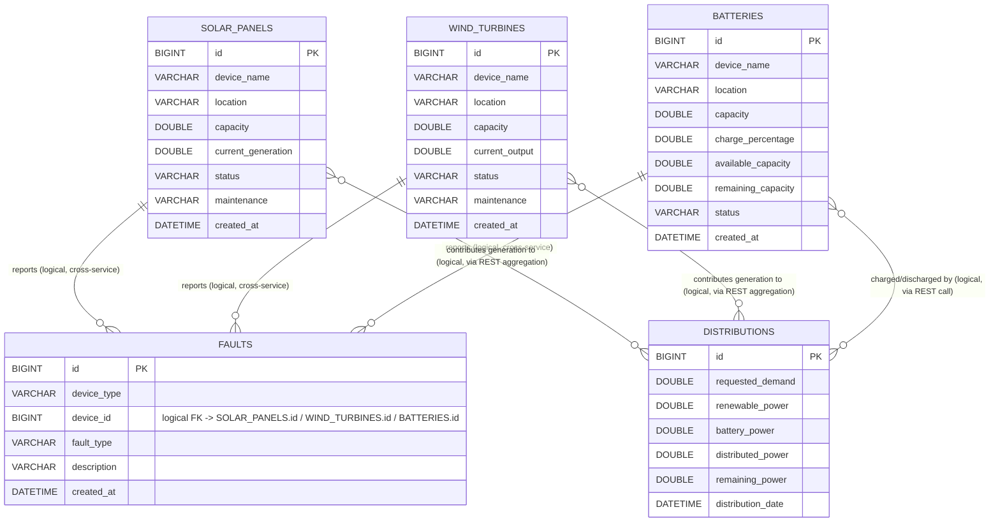

# Entity Relationship Diagram

Each microservice owns an independent MySQL schema (database-per-service
pattern). There are no physical cross-database foreign keys; relationships
between devices and distribution/fault records are logical and are resolved
at the application layer through RestTemplate calls between services.

## Relationship Notes

| Relationship | Type | Enforcement |
|---|---|---|
| `faults.device_id` -> `solar_panels.id` / `wind_turbines.id` / `batteries.id` | Logical FK, disambiguated by `faults.device_type` | Application layer (energy-distribution-service calls the owning service before recording a fault) |
| `distributions` aggregates power from solar + wind + battery | Many-to-many, computed | Application layer (RestTemplate calls at request time, not persisted as a join) |

## Primary Keys
- `solar_panels.id`, `wind_turbines.id`, `batteries.id`, `distributions.id`, `faults.id` — all `BIGINT AUTO_INCREMENT`.

## Indexes
- `solar_panels(status)`, `solar_panels(maintenance)`, `solar_panels(location)`
- `wind_turbines(status)`, `wind_turbines(maintenance)`, `wind_turbines(location)`
- `batteries(status)`, `batteries(charge_percentage)`
- `distributions(distribution_date)`
- `faults(device_type, device_id)`, `faults(created_at)`
